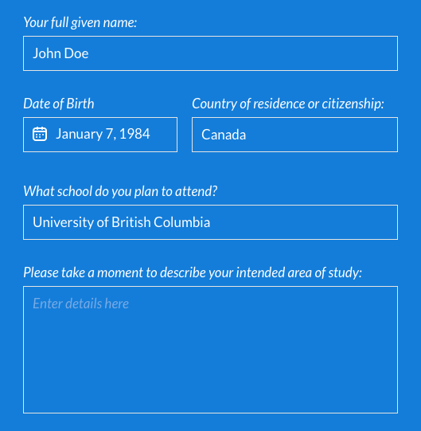
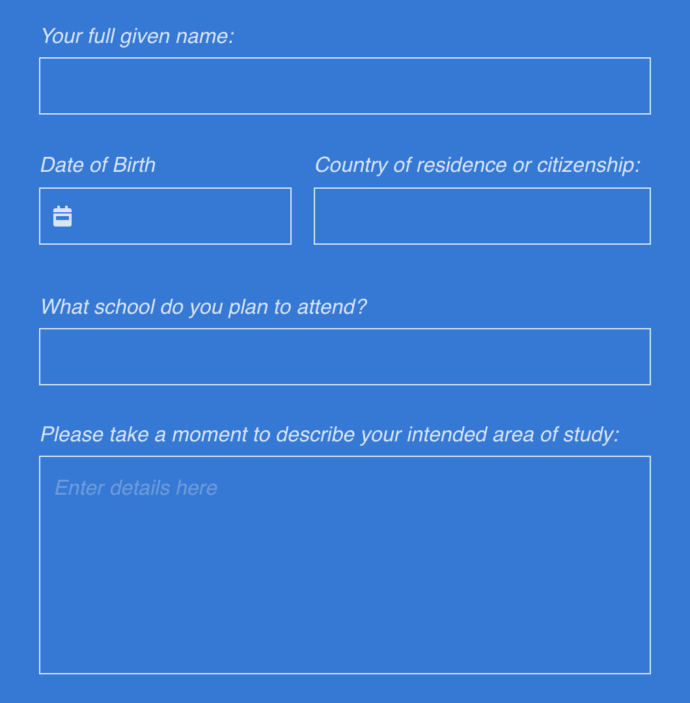

<h1 align="center">Assignment #2</h1>

## Question 📃

Using HTML and CSS please create this design as close to pixel perfect as possible. The text in the fields is there as an example, the fields should be blank when the page loads, with the exception of the date picker icon, and the helper text in the text area. Because we have not provided you with this specific date picker icon, you can select any free SVG date picker icon you can find.

## Solution 🚀

