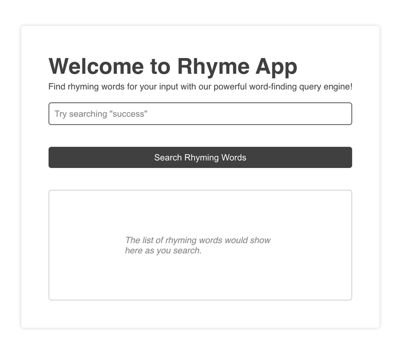

<h1 align="center">Assignment #5</h1>

## Question 📃

5Write a small React JS web application that prompts the user to enter a word, and in response provides a list of words that rhyme with that word. To find which words rhyme you may use an API, for example https://www.datamuse.com/api/ or any API of your choice.

**Note:** If you run into CORS issues you can launch chrome without CORS, and assume that we will do the same when we evaluate your submission.

## Solution 🚀



```bash
  # clone the repository
  git clone https://github.com/vinaysharma14/react-js-developer-quiz

  # open the assignment
  cd assignment-5

  # install dependencies and run
  npm i
  npm start
```
